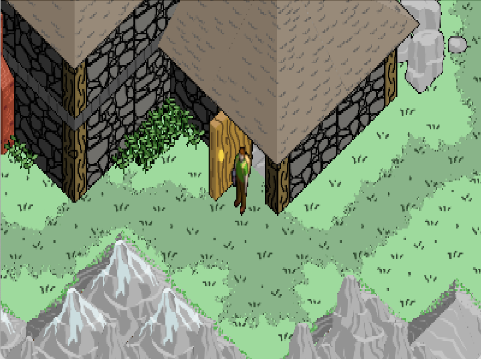

# Welcome back adventurer!
It's as if you never left. 

The fronds of time split and cluster in strange patterns. But if there is awareness behind the temporal ebb and flow, it's beyond your understanding.

All you know is the honor of the apprenticeship, the glory of serving the Necromancer. One day it will be your turn to command the alchemies and govern undeath. Until that day all you can do is observe and learn.

Between various chores, you dream of finally taking the necromantic vestments. Surely the master sees your potential and is grooming you to become a Great Wizard. 

You are certain, your ascent to the storied ranks of powerful magi is near. While dreaming of a future glory as certain as gold, all you have to bide is time...

`Enalim` is an isometric adventure game, written in [bscript](https://github.com/uzudil/benji4000/wiki/LanguageFeatures) running on [isongn](https://github.com/uzudil/isongn).

2021 (c) Gabor Torok

